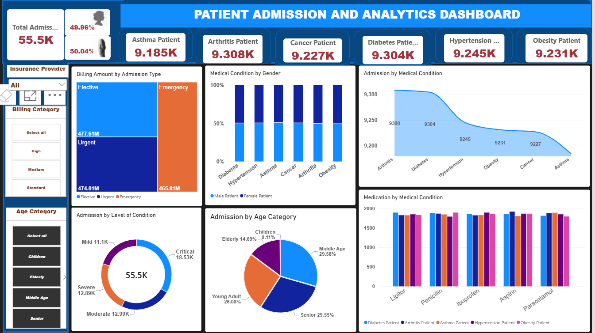

# Data Analytics Portfolio

# Project 1
**Title:** [Cookies Company Sales Performance Dashboard - Year 2019](https://github.com/D2AAROWOLO/Arowolo/blob/main/CookiesDBXlx.xlsx)

**Tools Used:** Microsoft Excel (Pivot Table, Pivot Chart, Slicer, Shapes, Textbox, Conditional Formatting, Custom Number Formatting, Chart Formatting)

**Project Description:** This project analyses the 2019 sales performance of a cookies company using an interactive Excel dashboard. The dataset includes product‑level sales, regional performance, and monthly trends. Using Pivot Tables, Pivot Charts, Slicers, and custom formatting, the dashboard provides a clear visual summary of how different cookie products performed throughout the year.
Key metrics such as total annual sales, top‑selling products, and monthly sales fluctuations are highlighted in the dashboard. Interactive slicers allow users to filter results by product type or region, making it easy to explore patterns and compare performance across categories. The Key Performance Indicators (KPIs) display total revenue, total cost, total profit, and total quantity sold.

**Key findings:** Overall Performance
The KPI cards show that the business generated strong total revenue (£3,587,102) in 2019, supported by healthy profit (£2,113,670) and a high total quantity (861,132) sold. This provides a clear snapshot of the company’s financial performance for the year.

Top Selling Products;
Chocolate Chip is the highest selling product, generating the largest share of total revenue (36%) and the highest quantity sold (255,993 units). It outperforms all other cookie varieties, making it the primary driver of revenue. This product should remain a strategic focus for production planning and marketing investment.

Monthly Sales Trends;
The line chart shows that sales peaked during the year, with October recording the highest sales and also the highest cost. This indicates that sales and cost of sales move in the same direction, suggesting effective cost management. Several months experienced noticeable dips, highlighting opportunities for targeted promotions or inventory adjustments during slower periods.

Regional Performance;
The regional chart shows that France recorded the highest sales, contributing more to total revenue than any other region. This highlights where customer demand is strongest. Lower performing regions may benefit from improved distribution, local marketing initiatives, or adjustments to the product mix.

Additionally, with the interactive filtering using slicers, stakeholders can immediately see how product performance varies by region and how regional trends shift across product categories. This dynamic filtering supports deeper exploration and faster, more informed decision making.

Conclusion
The dashboard provides clear visual insights using a combination of charts that show which products lead in revenue, how sales evolve month to month, and which regions drive the most value. These visuals help stakeholders quickly identify strengths, weaknesses, and potential growth opportunities.

**Dashboard Overview:**
 

# Project 2
**Title:** [5 Year Global Airline Performance Dashboard](https://github.com/D2AAROWOLO/Arowolo/blob/main/AirlineDB1.xlsx)

**Tools Used:** 
Microsoft Excel (Pivot Table, Pivot Chart, Slicer, Shapes, Textbox, Conditional Formatting, Custom Number Formatting, Chart Formatting, Data Cleaning and Normalisation)

**Project Description:** 
This dashboard provides a five year performance analysis of global airlines using interactive Excel visualizations. It highlights total revenue, market share across business region, business model, alongside a detailed five-year revenue trends, operational performance, and comparative growth across the top five airlines from 2022 to 2026. Using Pivot Tables, Pivot Charts, and slicers, the dashboard allows stakeholders to explore airline performance dynamically and compare how each airline evolves over time. 

**Key findings:**
Strong Growth in Total Revenue Across Five Years
All airlines demonstrate consistent year on year increases in Total Revenue, reflecting strong market demand, improved route performance, indicating stable demand and strong post pandemic recovery. 

Operating Revenue Shows How Well Each Airline Manages Its Core Operations
Operating Revenue represents the income an airline generates strictly from its core business activities. This KPI provides insight into how effectively the airline performs in its primary operations. Airlines with higher Operating Revenue demonstrate stronger demand for their core services, better utilisation of operational capacity, and more effective conversion of core activities into financial value. 

Passenger Distribution by Region Highlights Market Strength
Passenger numbers vary significantly across regions, revealing where airlines have strong market presence. High demand regions drive revenue growth and market share, while lower demand regions highlight opportunities for strategic expansion, improved route planning, or targeted marketing.

Market Share by Business Region Shows Competitive Positioning; The dashboard reveals clear differences in market share across business regions. Some airlines dominate specific regions, while others maintain a more balanced distribution. Understanding these patterns helps identify competitive strengths and potential growth markets.

Market Share by Business Model; The distribution of market share across Legacy, Low Cost, and Regional business models highlight how different airline strategies perform within the industry. Legacy carriers hold the largest share, reflecting their extensive route networks, established brand presence, and diversified service offerings. 

Five Year Revenue Trend Shows Predictable and Stable Growth; the trend chart shows smooth upward movement for all airlines from 2022 to 2026. Air France KLM and Lufthansa Group lead the group, while American Airlines, United Airlines, and Delta Air Lines show steady, moderate growth. This stability supports long term planning and investment confidence.

Additionally, the dashboard includes interactive slicers and a timeline. The slicers allow users to filter by airline, region, or performance category, enabling deeper exploration and quick comparison of performance across multiple dimensions, including individual years. This interactivity supports faster and more informed decision‑making.

**Dashboard Overview:**
 

# Project 3

**Title**:[Patient Admission and Analytics Dashboard]

**Tools Used**: 
Power BI Desktop, Power Query, DAX, Data Modeling, Calculated Columns, Measures, Conditional Formatting, Interactive Visualizations, KPI Cards, Slicers, SWITCH(), COUNT(), COUNTX(), DISTINCTCOUNT(), DIVIDE(), MAX(), and MIN()

**Project Description**:
This dashboard provides a comprehensive analysis of patient admissions, healthcare performance, and hospital operational metrics using interactive Power BI visualizations. It enables healthcare stakeholders to monitor admission trends, patient demographics, treatment outcomes, and key performance indicators that support data-driven decision-making.
It integrates multiple data sources using Power Query and uses DAX measures to calculate critical healthcare metrics, providing a clear view of patient flow, admission patterns, and resource utilization. Interactive slicers and filters allow users to explore data by admission type, diagnosis category, patient demographics, and treatment status, enabling deeper insight into healthcare service delivery.

Key findings:

Dashboard Overview:

